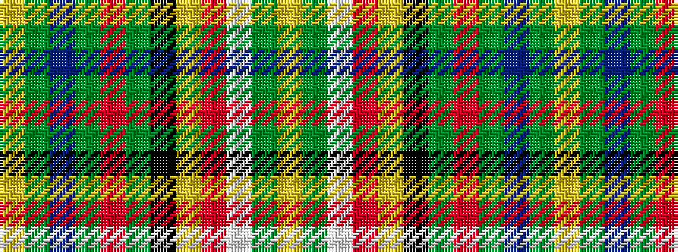

YGBGRGKYRWGY

It is a 12 stripe tartan.

<figure class="pat-woven">

<figcaption>idealised sample</figcaption>
</figure>

## Colour Sequence



## Tartans with this colour sequence

| Tartans |
|---------------|
| [Arizona](/setts/s12/lo3g2w2r2lo12k2g12r2g2t2g2ly2~x4/)|
||
