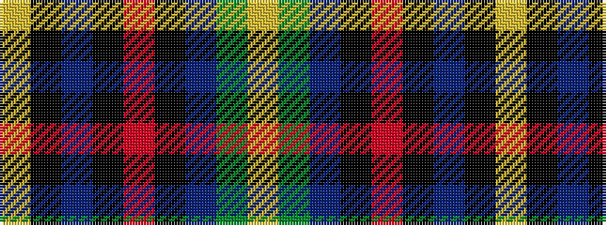

YGBKRKBKY

It is a 9 stripe tartan.

<figure class="pat-woven">

<figcaption>idealised sample</figcaption>
</figure>

## Colour Sequence



## Tartans with this colour sequence

| Tartans |
|---------------|
| [Kings Mountain 1780](/setts/s9/ly9k1n4k1r30k1t4g9ly3~x2/)|
||
