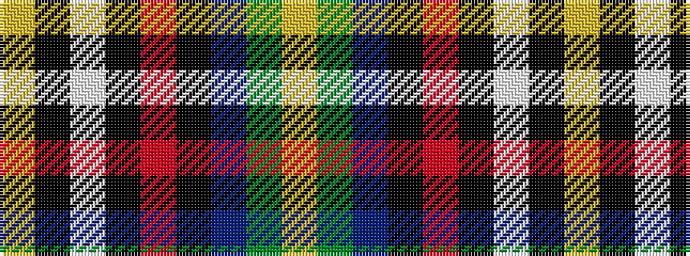

YGBKRKWKY

It is a 9 stripe tartan.

<figure class="pat-woven">

<figcaption>idealised sample</figcaption>
</figure>

## Colour Sequence



## Tartans with this colour sequence

| Tartans |
|---------------|
| [Kings Mountain 1780 (Commemorative)](/variants/s9/ly9k1lb4k1r40k1n4g9ly1~x2/)|
||
