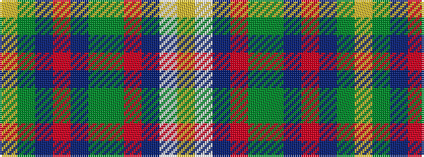

YGBRBGGRBWY

It is a 11 stripe tartan.

<figure class="pat-woven">

<figcaption>idealised sample</figcaption>
</figure>

## Colour Sequence



## Tartans with this colour sequence

| Tartans |
|---------------|
| [Banause-Zunft zu Olte](/setts/s11/ly2dg4dt1r3dt3dg3g1r32dt14w3ly2~x2/)|
||
