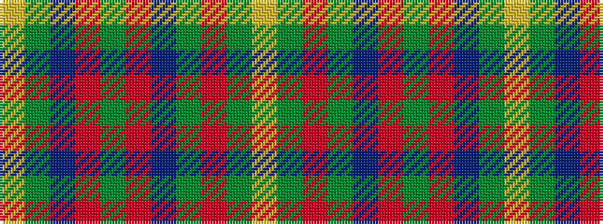

YGBRGRBGRGY

It is a 11 stripe tartan.

<figure class="pat-woven">

<figcaption>idealised sample</figcaption>
</figure>

## Colour Sequence



## Tartans with this colour sequence

| Tartans |
|---------------|
| [West Virginia Old Shawl](/variants/s11/ly1g1db2r2g2r12t2g1r2g1ly1~x4/)|
||
