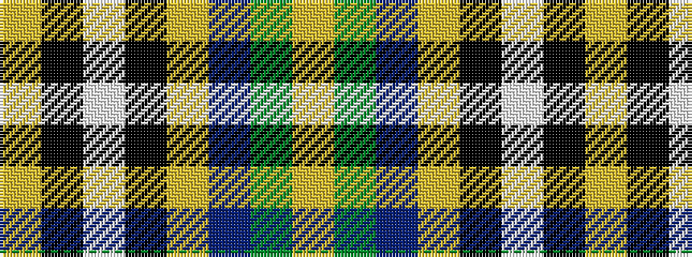

YGBYKWKY

It is a 8 stripe tartan.

<figure class="pat-woven">

<figcaption>idealised sample</figcaption>
</figure>

## Colour Sequence



## Tartans with this colour sequence

| Tartans |
|---------------|
| [Tunes of Glory (Film)](/setts/s8/lo3y40db12lo3k2lb4k2lo3~x2/)|
||
