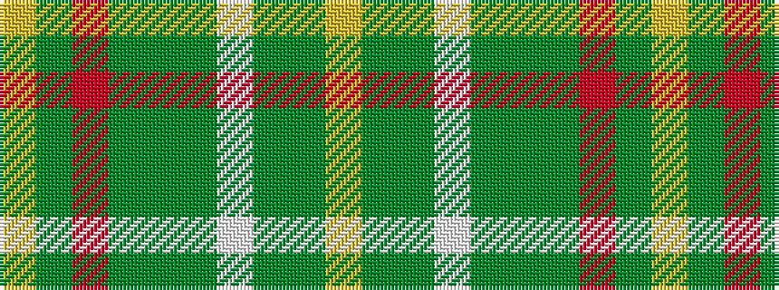

YGGWGGGRGY

It is a 10 stripe tartan.

<figure class="pat-woven">

<figcaption>idealised sample</figcaption>
</figure>

## Colour Sequence



## Tartans with this colour sequence

| Tartans |
|---------------|
| [Oxford University dress](/setts/s10/ly4g44dg5w2dg2g2dg2r2g3ly3~x2/)|
||
