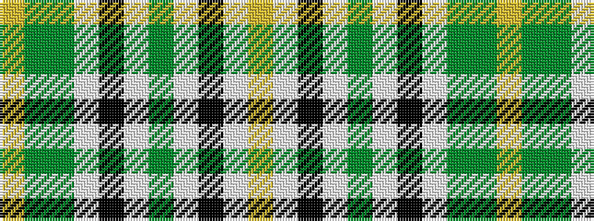

YGGWKWGWKWY

It is a 11 stripe tartan.

<figure class="pat-woven">

<figcaption>idealised sample</figcaption>
</figure>

## Colour Sequence



## Tartans with this colour sequence

| Tartans |
|---------------|
| [Tiree](/variants/s11/lo1y6g2w1k8w1g2w9k1w4ly1~x4/)|
||
