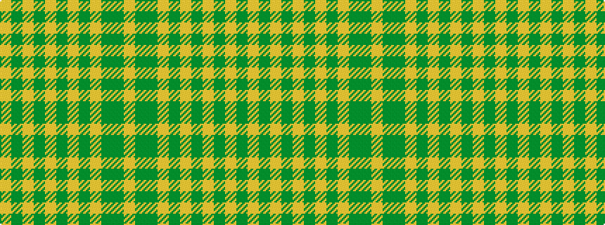

YGGYGYGYGYGY

It is a 12 stripe tartan.

<figure class="pat-woven">

<figcaption>idealised sample</figcaption>
</figure>

## Colour Sequence



## Tartans with this colour sequence

| Tartans |
|---------------|
| [Kelso (Fashion)](/variants/s12/lr12y3lr3dg4lr16y3lr3y3lr3y16dg52lr4/)|
||
