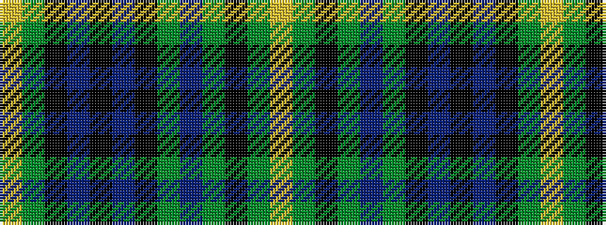

YGKBKBKGBGKGY

It is a 13 stripe tartan.

<figure class="pat-woven">

<figcaption>idealised sample</figcaption>
</figure>

## Colour Sequence



## Tartans with this colour sequence

| Tartans |
|---------------|
| [MacBride](/setts/s13/lo3g15k15db15k2db15k15g15dp3g15k15g15lo3~x2/)|
||
| [MacBride](/setts/s13/ly3g15k15db15k2db15k15g15dp3g15k15g15ly3~x2/)|
||
