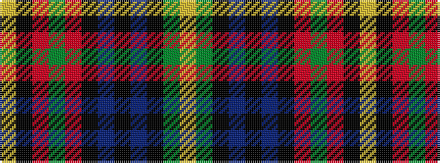

YGKBKBKRGRKY

It is a 12 stripe tartan.

<figure class="pat-woven">

<figcaption>idealised sample</figcaption>
</figure>

## Colour Sequence



## Tartans with this colour sequence

| Tartans |
|---------------|
| [Boyd](/tartans/lr5k4r4dg5r38k10db2k2db2k2dg22ly5/)|
||
