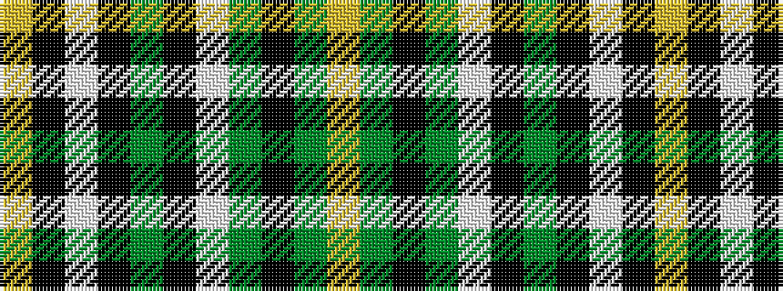

YGKGWKGKWKY

It is a 11 stripe tartan.

<figure class="pat-woven">

<figcaption>idealised sample</figcaption>
</figure>

## Colour Sequence



## Tartans with this colour sequence

| Tartans |
|---------------|
| [Offally County Crest (Fashion)](/setts/s11/ly24k8lp4k6g76k8w14g4k9g12lo10/)|
||
