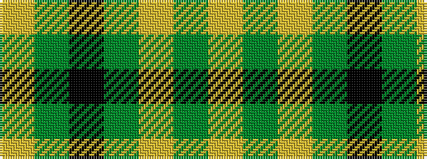

YGKGYGY

It is a 7 stripe tartan.

<figure class="pat-woven">

<figcaption>idealised sample</figcaption>
</figure>

## Colour Sequence



## Tartans with this colour sequence

| Tartans |
|---------------|
| [Angle, Green (Fashion)](/setts/s7/lo1dg11k6dg3lo1dg1lo1~x4/)|
||
