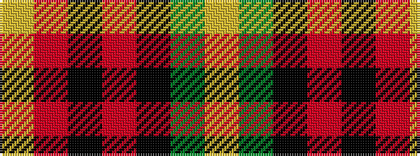

YGKRKRY

It is a 7 stripe tartan.

<figure class="pat-woven">

<figcaption>idealised sample</figcaption>
</figure>

## Colour Sequence



## Tartans with this colour sequence

| Tartans |
|---------------|
| [Blackstock Red (Dress)](/setts/s7/ly2dg7k6r11k1r1ly2~x4/)|
||
| [Blackstock, dress](/setts/s7/ly2g7k6r12k1r1ly2~x4/)|
||
