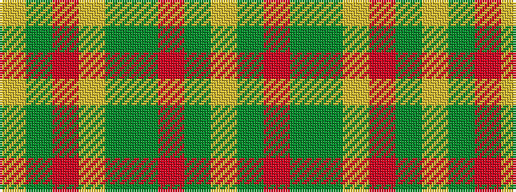

YGRGGYRGY

It is a 9 stripe tartan.

<figure class="pat-woven">

<figcaption>idealised sample</figcaption>
</figure>

## Colour Sequence



## Tartans with this colour sequence

| Tartans |
|---------------|
| [Monaghan Irish County Tartan](/variants/s9/lo3dy2o14dg17dy14lo8o14dy2lo3~x2/)|
||
