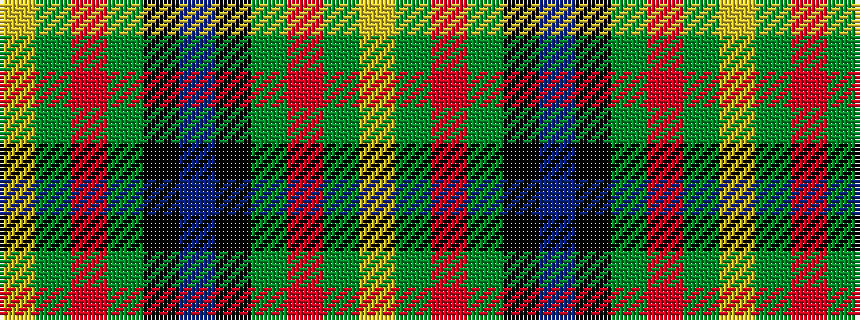

YGRGKBKGRGY

It is a 11 stripe tartan.

<figure class="pat-woven">

<figcaption>idealised sample</figcaption>
</figure>

## Colour Sequence



## Tartans with this colour sequence

| Tartans |
|---------------|
| [Loch Tay](/setts/s11/lr3dg3r2dg16k2db24k2dg16r2dg3ly3~x2/)|
||
