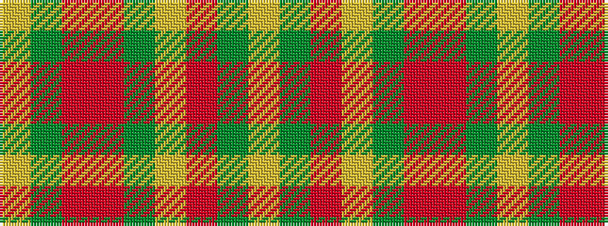

YGRRGYRGY

It is a 9 stripe tartan.

<figure class="pat-woven">

<figcaption>idealised sample</figcaption>
</figure>

## Colour Sequence



## Tartans with this colour sequence

| Tartans |
|---------------|
| [Unidentified Sett](/setts/s9/lr2dy1r10o12dy10lr6r10dy1lr2~x2/)|
||
