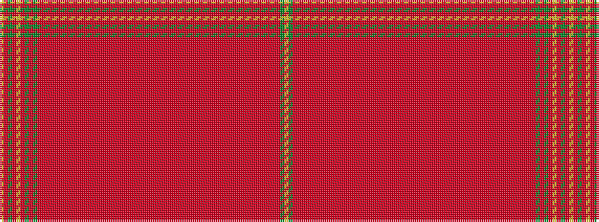

YGRRRRRRRRRRRRRRRRRRRRRRRRRRRRRRRRRRRRRRRRRRRRRRRRRRRRRRRRRRGRGRYRGRY

It is a 69 stripe tartan.

<figure class="pat-woven">

<figcaption>idealised sample</figcaption>
</figure>

## Colour Sequence



## Tartans with this colour sequence

| Tartans |
|---------------|
| [Collinet (Personal)](/setts/s69/lo102r6y6r6lr6r6g6r6g6rii1r1rii1r1rii1r1rii1r1rii1r1rii1r1rii1r1rii1r1rii1r1rii1r1rii1r1rii1r1rii1r1rii1r1rii1r1rii1r1rii1r1rii1r1rii1r1rii1r1rii1r1rii1r1rii1r1rii1r1rii1r1rii1r1rii1r1rii1r1rii1ri8g4l-h0881789bbe8a8367/)|
||
