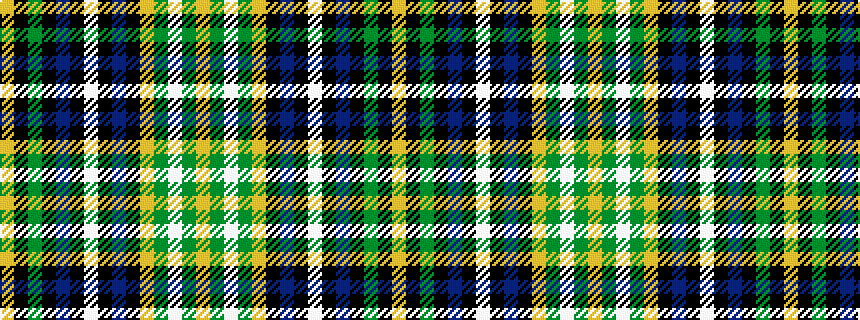

YGWGYKBKWKBKGKY

It is a 15 stripe tartan.

<figure class="pat-woven">

<figcaption>idealised sample</figcaption>
</figure>

## Colour Sequence



## Tartans with this colour sequence

| Tartans |
|---------------|
| [Lochalsh (Fashion)](/variants/s15/lo4g3w25g4lo4k12b16k2w4k2b16k12g16k2lo4/)|
||
