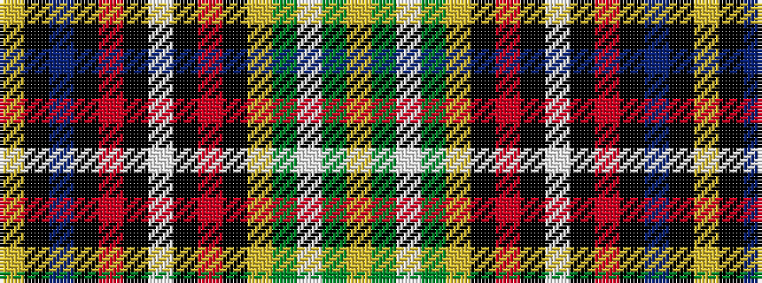

YGWGYKRKWKRKBKY

It is a 15 stripe tartan.

<figure class="pat-woven">

<figcaption>idealised sample</figcaption>
</figure>

## Colour Sequence



## Tartans with this colour sequence

| Tartans |
|---------------|
| [Dunkeld](/setts/s15/lo2dy2w12dy2lo2k6r8k1w2k1r8k6do8k1lo2~x2/)|
||
