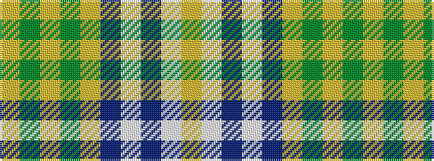

YGYGYBWBWY

It is a 10 stripe tartan.

<figure class="pat-woven">

<figcaption>idealised sample</figcaption>
</figure>

## Colour Sequence



## Tartans with this colour sequence

| Tartans |
|---------------|
| [Henry, David G (Personal)](/variants/s10/lo2w1db4w1db1lo1dg12lo1dg2lo1~x4/)|
||
