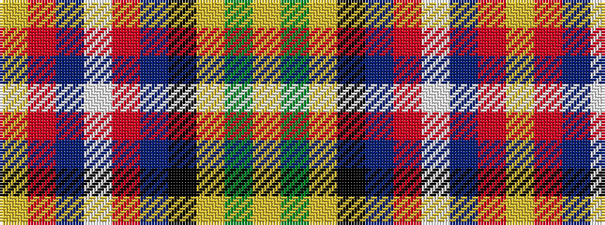

YGYKBRWBRY

It is a 10 stripe tartan.

<figure class="pat-woven">

<figcaption>idealised sample</figcaption>
</figure>

## Colour Sequence



## Tartans with this colour sequence

| Tartans |
|---------------|
| [Australian Heavy Horse (Corporate)](/variants/s10/lr4oi2n2w2o16n5k2lr18g2lr4~x2/)|
||
