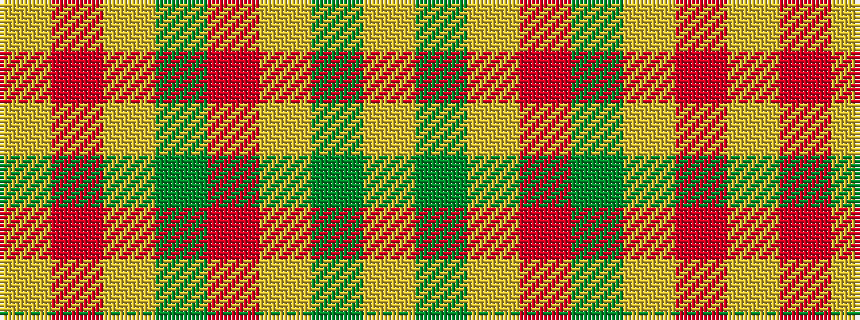

YGYRGYRY

It is a 8 stripe tartan.

<figure class="pat-woven">

<figcaption>idealised sample</figcaption>
</figure>

## Colour Sequence



## Tartans with this colour sequence

| Tartans |
|---------------|
| [Glufree](/setts/s8/ly8r2ly8g1r6ly3g4ly2~x4/)|
||
