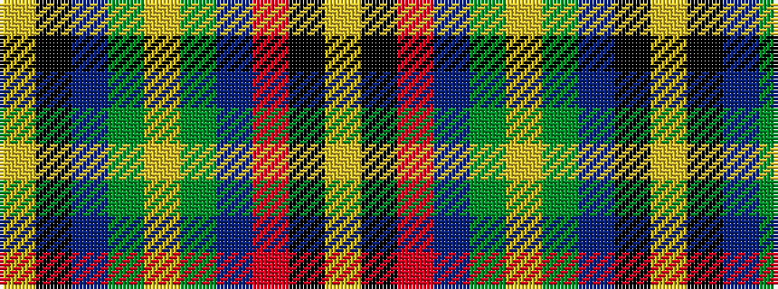

YKBGYGBRKY

It is a 10 stripe tartan.

<figure class="pat-woven">

<figcaption>idealised sample</figcaption>
</figure>

## Colour Sequence



## Tartans with this colour sequence

| Tartans |
|---------------|
| [Guardian of Scotland, Wthd (Fashion)](/variants/s10/ly2k1r30n8y24lo5y5dp11k1ly2~x2/)|
||
