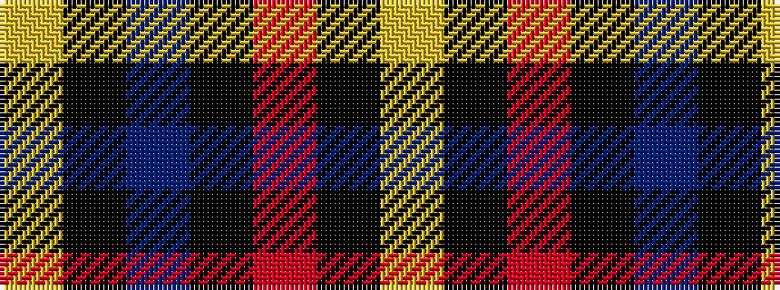

YKBKRKY

It is a 7 stripe tartan.

<figure class="pat-woven">

<figcaption>idealised sample</figcaption>
</figure>

## Colour Sequence



## Tartans with this colour sequence

| Tartans |
|---------------|
| [LP Cover (Dance)](/setts/s7/ly3k9b1k1r6k2ly3~x4/)|
||
