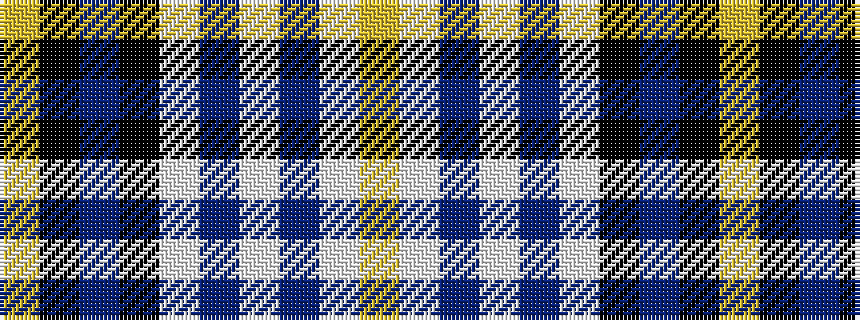

YKBKWBWBWY

It is a 10 stripe tartan.

<figure class="pat-woven">

<figcaption>idealised sample</figcaption>
</figure>

## Colour Sequence



## Tartans with this colour sequence

| Tartans |
|---------------|
| [Chieftain](/variants/s10/ly1k4db2k10w1db2w10db1w4ly1~x4/)|
||
