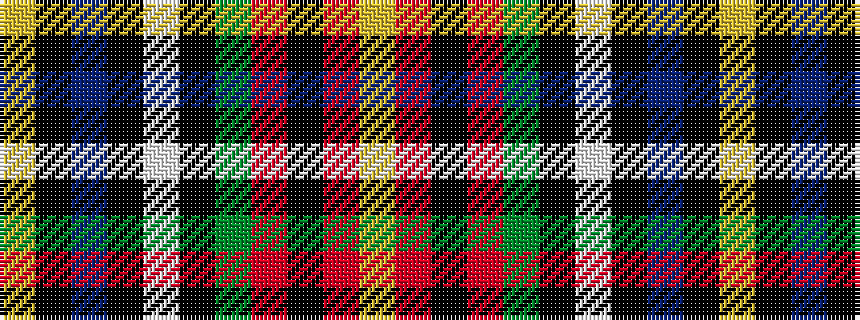

YKBKWKGRKRY

It is a 11 stripe tartan.

<figure class="pat-woven">

<figcaption>idealised sample</figcaption>
</figure>

## Colour Sequence



## Tartans with this colour sequence

| Tartans |
|---------------|
| [U.S. Customs & Border Protection (C](/setts/s11/lo24k7db1k1w1k1dy4r3k1r2lo1~x4/)|
||
