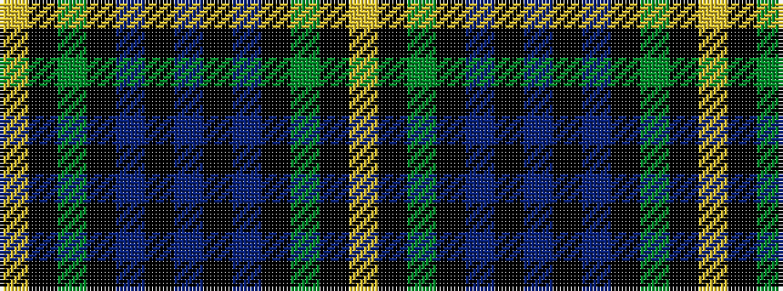

YKGKBKBKBKGKY

It is a 13 stripe tartan.

<figure class="pat-woven">

<figcaption>idealised sample</figcaption>
</figure>

## Colour Sequence



## Tartans with this colour sequence

| Tartans |
|---------------|
| [Campbell of Loudon](/variants/s13/lr2k1dg12k12db12k1db2k1db12k12dg12k1ly2~x2/)|
||
| [Campbell of Loudon](/variants/s13/lr4k1dg12k12db12k1db4k1db12k12dg12k1ly4~x2/)|
||
