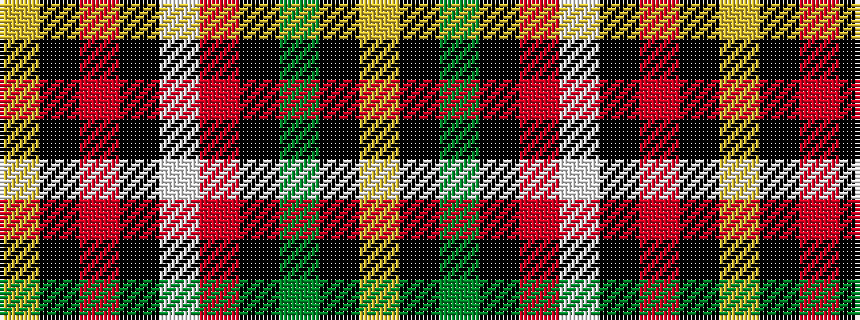

YKGKRWKRKY

It is a 10 stripe tartan.

<figure class="pat-woven">

<figcaption>idealised sample</figcaption>
</figure>

## Colour Sequence



## Tartans with this colour sequence

| Tartans |
|---------------|
| [MacLamroc](/setts/s10/ly4k1r16k16w3r1k16g16k1ly4~x2/)|
||
