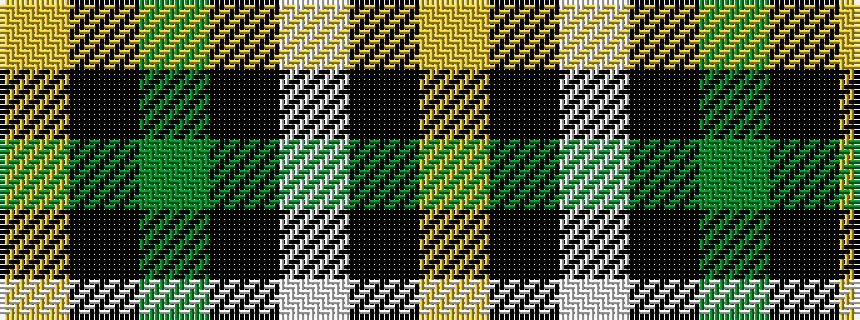

YKGKWKY

It is a 7 stripe tartan.

<figure class="pat-woven">

<figcaption>idealised sample</figcaption>
</figure>

## Colour Sequence



## Tartans with this colour sequence

| Tartans |
|---------------|
| [Cape Breton (yellow stripes)](/setts/s7/ly6k6y30k8lb18k6ly3~x2/)|
||
