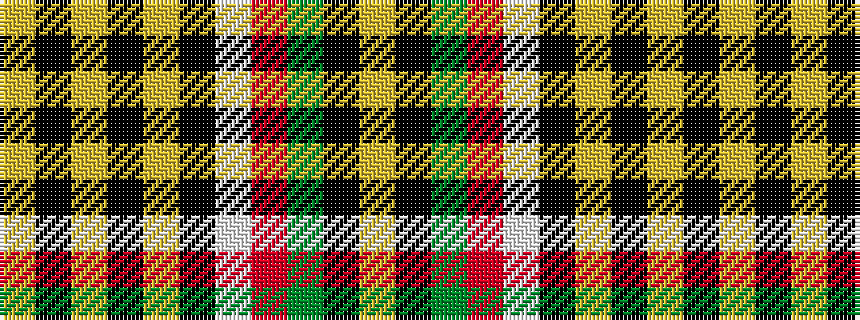

YKGRWKYKYKY

It is a 11 stripe tartan.

<figure class="pat-woven">

<figcaption>idealised sample</figcaption>
</figure>

## Colour Sequence



## Tartans with this colour sequence

| Tartans |
|---------------|
| [Sligo County Crest (Fashion)](/setts/s11/lo8k16lr8k52lr6k5w27r20y14k5lr6/)|
||
