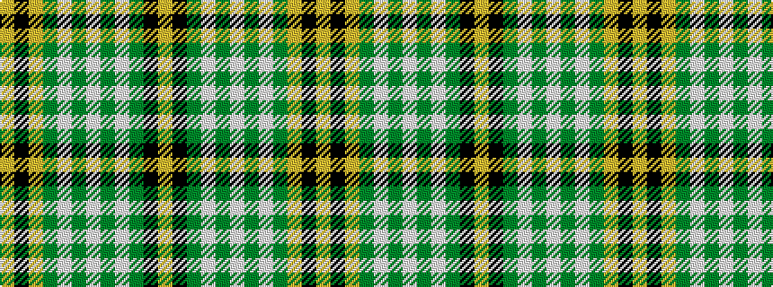

YKGWGWGWGYKY

It is a 12 stripe tartan.

<figure class="pat-woven">

<figcaption>idealised sample</figcaption>
</figure>

## Colour Sequence



## Tartans with this colour sequence

| Tartans |
|---------------|
| [Delta Lambda Phi](/variants/s12/ly5k1ly6g20w1g3w1g3w1g30k1ly2~x2/)|
||
| [Delta Lambda Phi (Corporate)](/variants/s12/lo5k1lo6g20w1g3w1g3w1g30k1lo2~x2/)|
||
