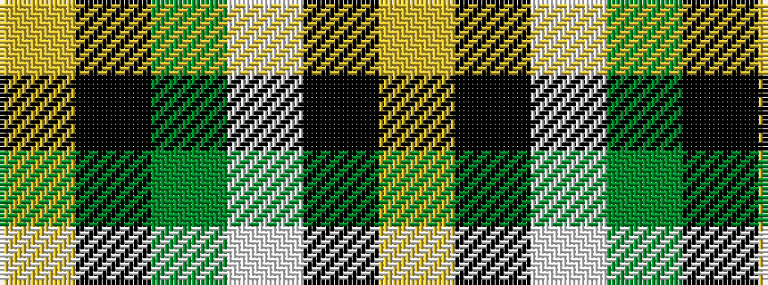

YKGWKY

It is a 6 stripe tartan.

<figure class="pat-woven">

<figcaption>idealised sample</figcaption>
</figure>

## Colour Sequence



## Tartans with this colour sequence

| Tartans |
|---------------|
| [Brandon Manitoba Trade Tartan Tartan Number: 1884. Earliest known date: pre 1997 From Dalgleish as Hamilton of Brandon. There is a similarity to Cape Breton. And to Paton's Jacobite. See products available Copyright © Blair Urquhart, Comrie, 2015](/setts/s6/ly83k35w3g35k3ly10/)|
||
| [Hamilton of Brandon (Fashion)](/setts/s6/lo16k7w1g7k1ly3~x4/)|
||
| [Jacobite](/setts/s6/ly70k30w3g30k3ly10/)|
||
| [Jacobite #2](/setts/s6/ly70k30w3dg30k3ly10/)|
||
