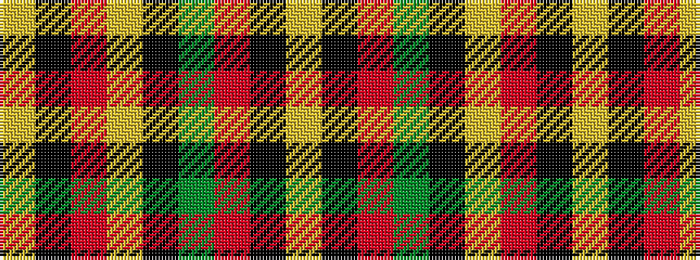

YKRGKYRKY

It is a 9 stripe tartan.

<figure class="pat-woven">

<figcaption>idealised sample</figcaption>
</figure>

## Colour Sequence



## Tartans with this colour sequence

| Tartans |
|---------------|
| [Graham Red](/setts/s9/lr1k1r10g10k5lr5r10k1lr1~x4/)|
||
