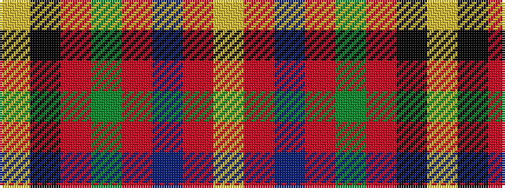

YKRGRBRY

It is a 8 stripe tartan.

<figure class="pat-woven">

<figcaption>idealised sample</figcaption>
</figure>

## Colour Sequence



## Tartans with this colour sequence

| Tartans |
|---------------|
| [Royal College of G.P.s (Corporate)](/setts/s8/lo8k50o15dg6o6db3o6lo2~x2/)|
||
| [Royal College of General Practitioners](/setts/s8/lo11k66o32dg11o10db6o10loi4/)|
||
