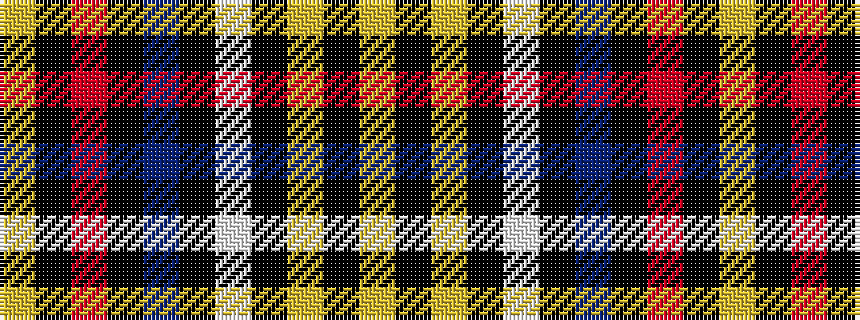

YKRKBKWKYKY

It is a 11 stripe tartan.

<figure class="pat-woven">

<figcaption>idealised sample</figcaption>
</figure>

## Colour Sequence



## Tartans with this colour sequence

| Tartans |
|---------------|
| [Dublin County Crest (Fashion)](/variants/s11/lo9k8lo30k4lb8k4db24k54r14k4lr8/)|
||
