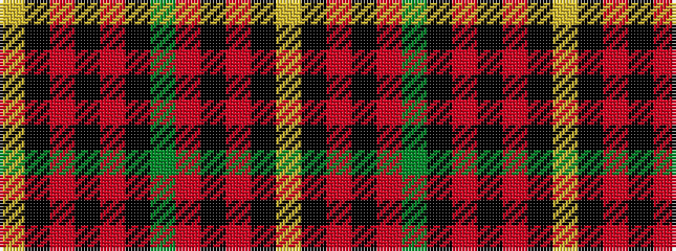

YKRKRGKRKRKY

It is a 12 stripe tartan.

<figure class="pat-woven">

<figcaption>idealised sample</figcaption>
</figure>

## Colour Sequence



## Tartans with this colour sequence

| Tartans |
|---------------|
| [Integrated Landscape Management (ILM)](/setts/s12/ly6k2r8k4r64g14k63r4k4r8k2ly6/)|
||
