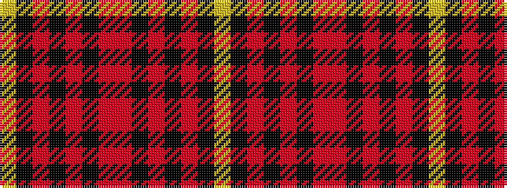

YKRKRKRRKRKRKY

It is a 14 stripe tartan.

<figure class="pat-woven">

<figcaption>idealised sample</figcaption>
</figure>

## Colour Sequence



## Tartans with this colour sequence

| Tartans |
|---------------|
| [German Heritage](/variants/s14/lo4k2ri8k4ri4k63r5ri64k4ri3k4ri8k2lo4/)|
||
