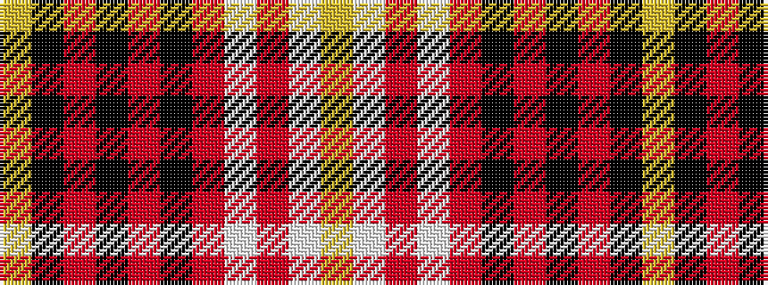

YKRKRKRWRWY

It is a 11 stripe tartan.

<figure class="pat-woven">

<figcaption>idealised sample</figcaption>
</figure>

## Colour Sequence



## Tartans with this colour sequence

| Tartans |
|---------------|
| [Chartered Institute of Bankers in Scotland](/variants/s11/ly5lb36o5lb5o56k5o8k5o5k34ly5/)|
||
