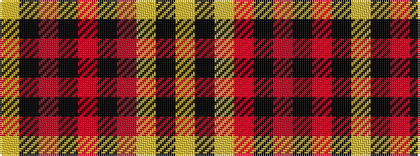

YKRKRKRYKY

It is a 10 stripe tartan.

<figure class="pat-woven">

<figcaption>idealised sample</figcaption>
</figure>

## Colour Sequence



## Tartans with this colour sequence

| Tartans |
|---------------|
| [Einigkeit](/setts/s10/ly6k2ly2r10k4r4k4r2k35ly2~x2/)|
||
