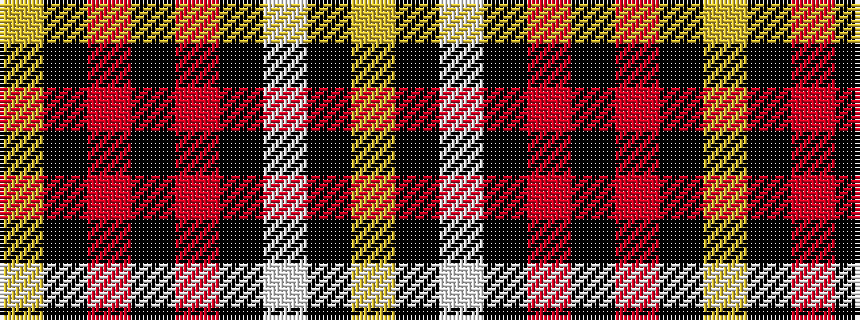

YKRKRKWKY

It is a 9 stripe tartan.

<figure class="pat-woven">

<figcaption>idealised sample</figcaption>
</figure>

## Colour Sequence



## Tartans with this colour sequence

| Tartans |
|---------------|
| [Bunnahabhain](/setts/s9/lo8k7r3k7r3k38w2k3lo6~x2/)|
||
