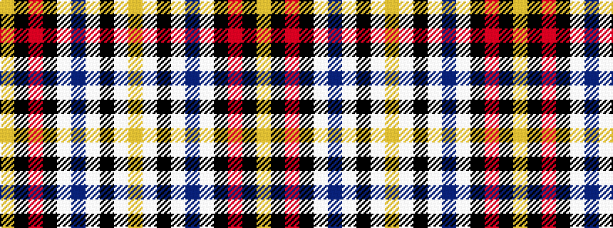

YKRKWBWKWY

It is a 10 stripe tartan.

<figure class="pat-woven">

<figcaption>idealised sample</figcaption>
</figure>

## Colour Sequence



## Tartans with this colour sequence

| Tartans |
|---------------|
| [Stewart Fawn Trade Tartan](/variants/s10/lo24k5r2k2w2n8w3k2w2lo2~x2/)|
||
