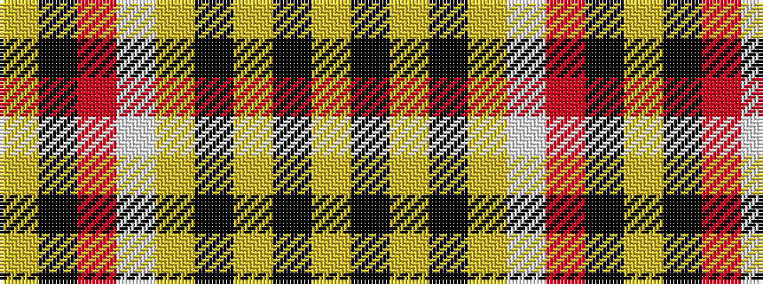

YKRWYKYKY

It is a 9 stripe tartan.

<figure class="pat-woven">

<figcaption>idealised sample</figcaption>
</figure>

## Colour Sequence



## Tartans with this colour sequence

| Tartans |
|---------------|
| [Motherwell Football Club. Modern](/setts/s9/lr60k6lr8k2lr8w2r12k49lo4/)|
||
