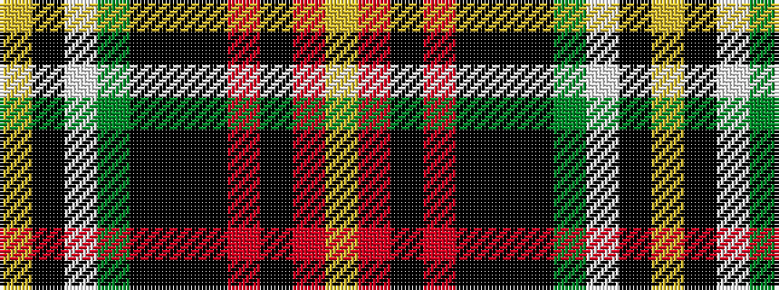

YKWGKKKRKRY

It is a 11 stripe tartan.

<figure class="pat-woven">

<figcaption>idealised sample</figcaption>
</figure>

## Colour Sequence



## Tartans with this colour sequence

| Tartans |
|---------------|
| [Louth County, Crest Range](/setts/s11/lo16o5k8o8k16k48k4dg46w8k8lr8/)|
||
