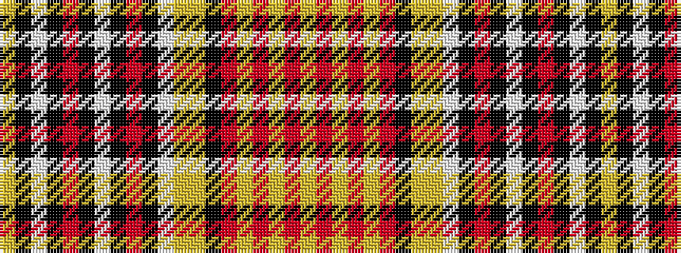

YKWKRKWKRKWYYKRYRYRY

It is a 20 stripe tartan.

<figure class="pat-woven">

<figcaption>idealised sample</figcaption>
</figure>

## Colour Sequence



## Tartans with this colour sequence

| Tartans |
|---------------|
| [Whisky](/setts/s20/ly10k2w3k6o4k2lb8k2o4k6lb3lr49lo4k42o42ly6o6ly6o6ly8/)|
||
