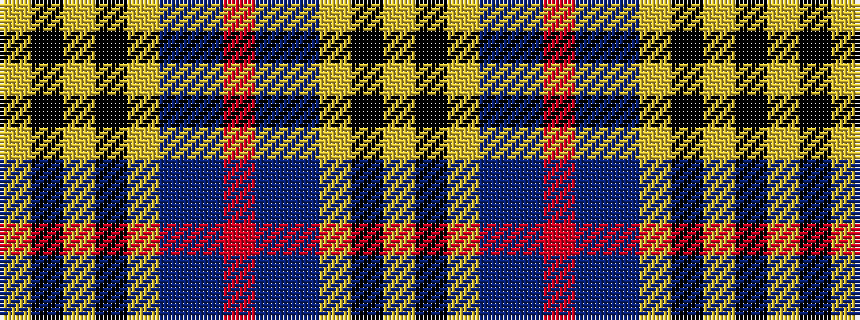

YKYBBRBBYKYKY

It is a 13 stripe tartan.

<figure class="pat-woven">

<figcaption>idealised sample</figcaption>
</figure>

## Colour Sequence



## Tartans with this colour sequence

| Tartans |
|---------------|
| [MacLachlan, Gold Dress (Fashion)](/setts/s13/lo16k2lo2k2lo2db16db16r3db16db16lo16k2lo2~x2/)|
||
