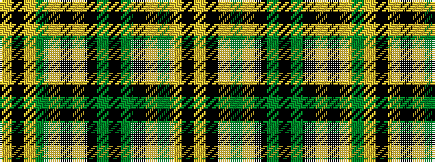

YKYGYKGKGKYKYGYKY

It is a 17 stripe tartan.

<figure class="pat-woven">

<figcaption>idealised sample</figcaption>
</figure>

## Colour Sequence



## Tartans with this colour sequence

| Tartans |
|---------------|
| [Clergy](/setts/s17/lr1k5lr1y4lr1k26lr1k10y5k2y5k10lr1y4lr1k5lr1~x2/)|
||
| [Clergy](/setts/s17/lr1k5lr1y4lr1k26lr1k10y5k2y5k10lr1y4lr1k5lr1/)|
||
