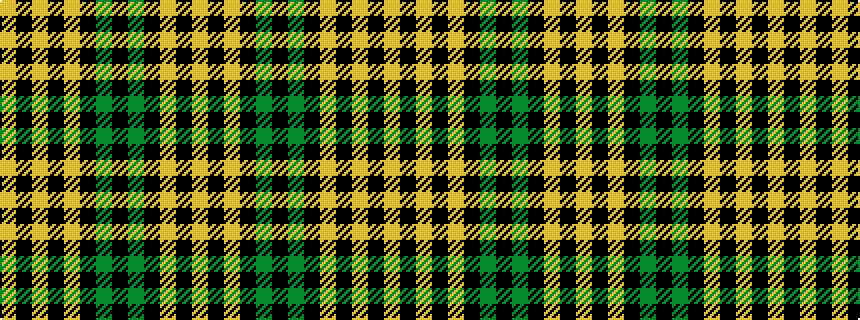

YKYKGKGKYKYKY

It is a 13 stripe tartan.

<figure class="pat-woven">

<figcaption>idealised sample</figcaption>
</figure>

## Colour Sequence



## Tartans with this colour sequence

| Tartans |
|---------------|
| [Brown Watch](/variants/s13/lo12k2lo2k2lo2k10g12k3g12k10lo12k2lo2~x2/)|
||
| [Campbell Collegiate](/variants/s13/ly18k3ly3k3ly3k13g16k4g16k13ly16k3ly3~x2/)|
||
| [Campbell Collegiate (Corporate)](/variants/s13/ly18k3ly3k3ly3k13dg16k4dg16k13ly16k3ly3~x2/)|
||
