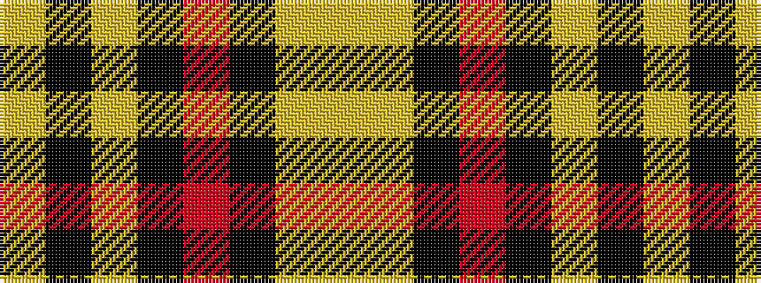

YKYKRKYY

It is a 8 stripe tartan.

<figure class="pat-woven">

<figcaption>idealised sample</figcaption>
</figure>

## Colour Sequence



## Tartans with this colour sequence

| Tartans |
|---------------|
| [Crane of Cluny Hunting (Personal)](/variants/s8/lo83k6lo3k9r2k5lo2ly2~x2/)|
||
