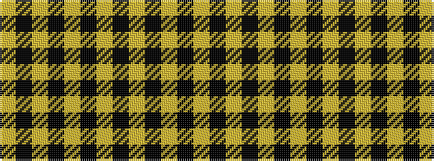

YKYKYKYKYKYKY

It is a 13 stripe tartan.

<figure class="pat-woven">

<figcaption>idealised sample</figcaption>
</figure>

## Colour Sequence



## Tartans with this colour sequence

| Tartans |
|---------------|
| [Yamaguchi Tsutomu](/setts/s13/ly20k3ly10k6ly8k8ly6k10ly3k12ly2k14ly1~x2/)|
||
